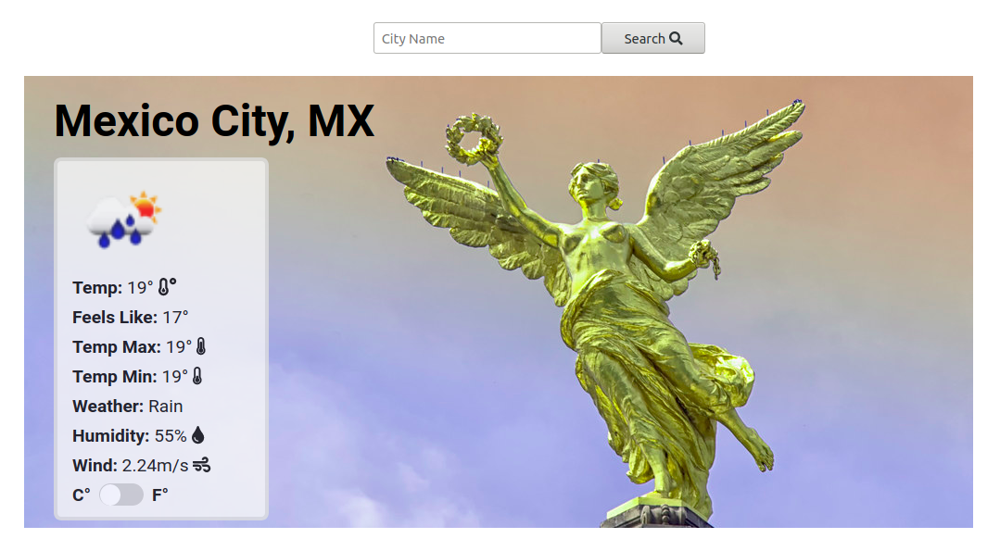

# Weather App
The Weather App project is to test the knowledge about asynchronous communication with promises or async/await and when to use them. Using weather API from [openweathermap.org](openweathermap.org)




## :package: Built With

- Plain HTML5
- Pure CSS3
- Pure Javascript
- Webpack

## :mag: Live Demo

[Live Demo Link](https://mcervantes71.github.io/Weather_App/dist/)

## :computer: Getting Started

To get a local copy up and running follow these simple steps.


### Download

1) Clone the repository to your local machine

```sh
  $ git clone https://github.com/mcervantes71/Weather_App.git
```

2) cd into the directory

```sh
  $ cd Weather_App
```

### Usage

In any browser, open the index.html file.

## :busts_in_silhouette: Authors

👤 **Martin Cervantes**

- Linkedin: [Martin Cervantes](https://www.linkedin.com/in/cervantesmartin/)
- Twitter: [@M4rt1nC3rv4nt3s](https://twitter.com/M4rt1nC3rv4nt3s)
- Github: [@mcervantes71](https://github.com/mcervantes71)
- Gmail: [cervantes.martine](mailto:cervantes.martine@gmail.com)

## 🤝 Contributing

    Contributions, issues and feature requests are welcome!

Feel free to check the [issues page](../../issues).

## :star2: Show your support

    Give a ⭐️ if you like this project!

## 📝 License

This project is [MIT](lic.url) licensed.
